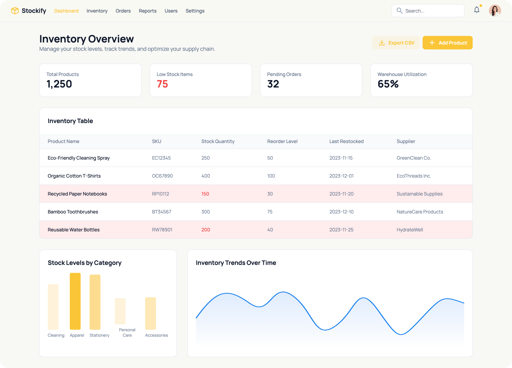
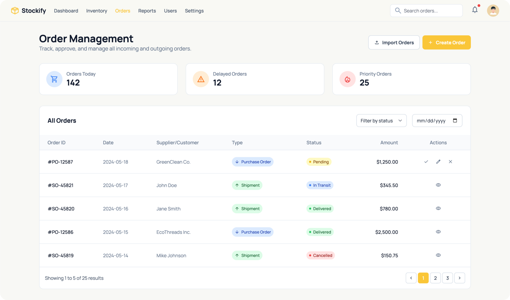
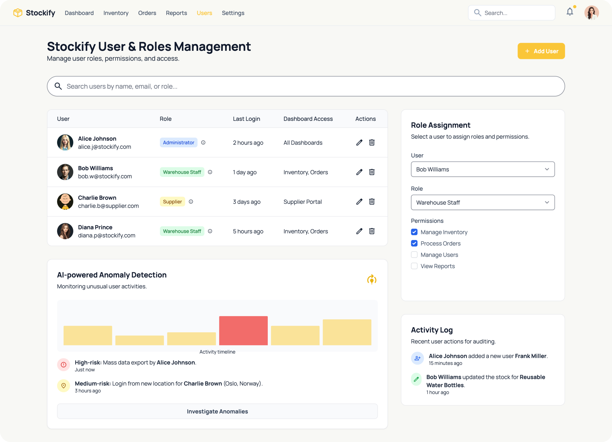

# Stockify v2 - AI-Powered Inventory Management Application for Businesses
> **Link to Stockify v1(https://github.com/prxtxks/stockify-v1)**: 


## Project Overview

**Stockify** is a modern web application that helps businesses **track inventory, manage products, handle orders, and control user access**, all while providing **data visualizations and AI-powered anomaly detection**.  

Key Features:  
- **Inventory Management:** Add, update, and track products across multiple warehouses.  
- **Order Management:** Track incoming and outgoing orders, with status indicators (pending, in transit, delivered).  
- **User Management:** Manage staff, admins, and suppliers with role-based access control.  
- **Analytics & Reports:** Visualize stock levels, sales trends, and performance metrics.  
- **AI Anomaly Detection:** Detect unusual patterns in inventory or orders automatically.

## UI Mockups

> Dashboard:



> Orders Management:



> Users & Access Control:



## ⚙️ Tech Stack

- **Frontend:** HTML, CSS, JavaScript  
- **Backend:** Python / Flask or Node.js (customize based on your implementation)  
- **Database:** PostgreSQL / MySQL  
- **Data Handling & AI:** Pandas, NumPy, Scikit-Learn (Anomaly Detection Models)  
- **Visualization:** Chart.js, Plotly, D3.js (interactive dashboards)  

## System Workflow

1. **User Login / Authentication** → Role-based access for staff, admins, and suppliers.  
2. **Dashboard Overview** → Quick KPIs, inventory trends, and AI anomaly alerts.  
3. **Inventory Management** → Add/edit/delete products, manage stock levels.  
4. **Order Management** → Track purchase orders, shipments, and approvals.  
5. **User Management** → Assign roles, monitor activity logs.  
6. **Reports & Analytics** → Visualize trends, detect anomalies, export reports.  

## How to Run Locally

```bash
# Clone Repository
git clone https://github.com/yourusername/stockify.git
cd stockify

# Setup Environment
pip install -r requirements.txt  # or npm install for Node.js version

# Run Application
python app.py  # or npm start for Node.js version
```

## Why This Matters

**Stockify** empowers businesses to:  
- Reduce human errors in inventory tracking  
- Gain insights into stock trends and sales patterns  
- Detect unusual activity in real time using AI  
- Streamline operations across multiple warehouses  


<p align="center">
Crafted with ❤️
</p>
